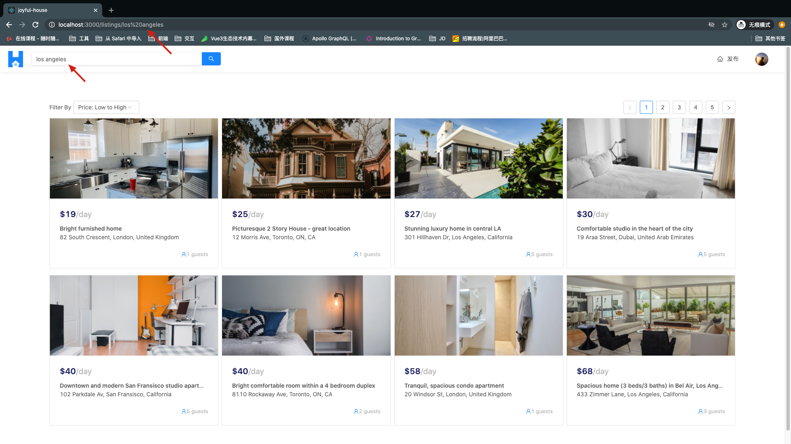
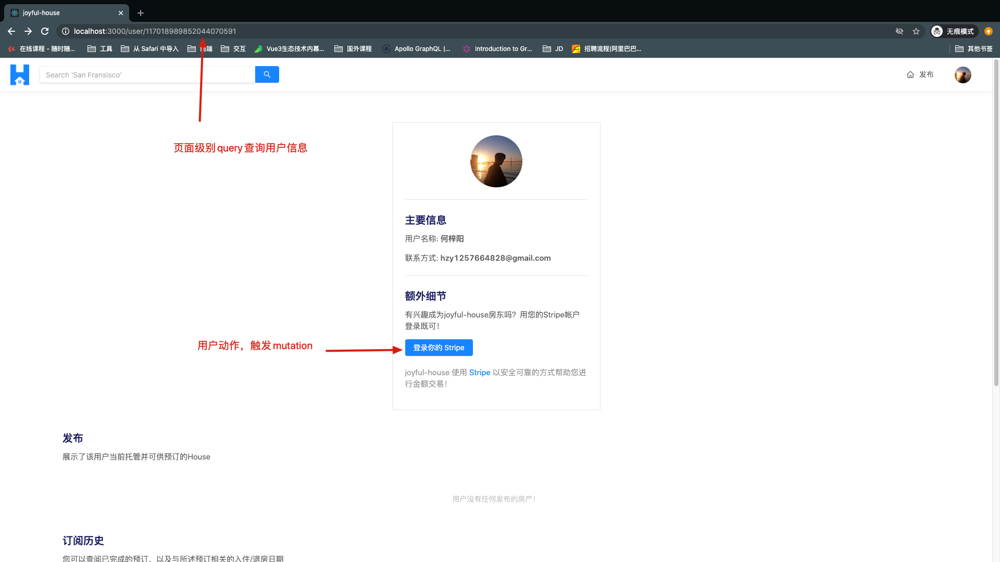
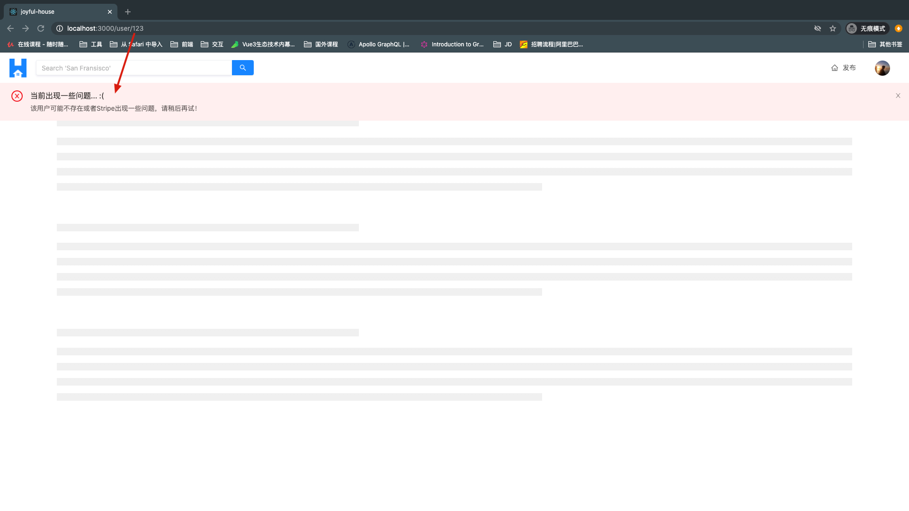

- [Technology Stack](#technology-stack)
  - [front-end](#front-end)
  - [back-end](#back-end)
- [Online](#online)
- [Run](#run)
- [Overview](#overview)
  - [Google OAuth 2.0 和 cookie 持久化](#google-oauth-20-和-cookie-持久化)
  - [Google's Geocoding API](#googles-geocoding-api)
  - [Stripe](#stripe)
  - [Cloudinary](#cloudinary)
  - [Heroku](#heroku)
- [Features](#features)
  - [Google登录](#google登录)
  - [搜索功能](#搜索功能)
  - [House 详情](#house-详情)
  - [订阅](#订阅)
  - [连接 Stripe](#连接-stripe)
  - [创建 House](#创建-house)
  - [查看历史订单](#查看历史订单)
  - [查看其他用户](#查看其他用户)
- [Walkthrough of Code](#walkthrough-of-code)
  - [API-Driven Approach](#api-driven-approach)
  - [server](#server)
    - [src](#src)
    - [temp](#temp)
  - [client](#client)
    - [src](#src-1)
- [Code Patterns](#code-patterns)
  - [文件结构和导出](#文件结构和导出)
    - [类似的功能组合在一起](#类似的功能组合在一起)
    - [创建显式索引文件并以“最方便的方式”导出](#创建显式索引文件并以最方便的方式导出)
  - [路由和URL参数](#路由和url参数)
    - [URL参数以获取特定信息](#url参数以获取特定信息)
  - [Query & Mutation](#query--mutation)
    - [页面级别Query和用户操作Mutation](#页面级别query和用户操作mutation)
  - [一个Features 落地的顺序](#一个features-落地的顺序)
- [TODO](#todo)
- [Last](#last)

<small><i><a href='http://ecotrust-canada.github.io/markdown-toc/'>Table of contents generated with markdown-toc</a></i></small>

## Technology Stack

### front-end

TypeScipt + React + React-Router + React-hooks + React Apollo

### back-end

MongoDB + Node.js + Express + GraphQL

## Online

[joyful-house-app](https://joyfull-house-app.herokuapp.com/)

说明：

- 由于免费部署在heroku 平台上，每隔1个小时项目会进行睡眠，此时访问会唤醒heroku，**需要等待半分钟左右（再次刷新即可）**
- 项目中用到了Google OAuth，所以需要各位**挂梯子**才能登陆

## Run

在server端需要配置以下内容（详情请见官方网站，非常简单的配置的）：

```shell
#文件路径：server/.env

# 项目配置
PORT=9000
NODE_ENV=development
PUBLIC_URL=http://localhost:3000 # 前端服务器地址

# MongoDB配置
DB_USER= XXX # MongoDB Atlas 用户ID
DB_USER_PASSWORD= XXX # MongoDB 用户密码
DB_CLUSTER= XXX #集群ID

# Goolge OAuth API 请到 google clound 创建账户
# 注意查阅google OAuth 配置方案，别写错回填地址...

G_CLIENT_ID= XXX # Google OAuth id
G_CLIENT_SECRET= XXX # 认证秘钥

# Google geography API
# 和 OAuth 类似的配置
G_GEOCODE_KEY= XXX # id
S_SECRET_KEY= XXX # 密码

# Stripe 用于支付的配置
# 同理 按文档填入即可

CLOUDINARY_NAME= XXX
CLOUDINARY_KEY= XXX
CLOUDINARY_SECRET= XXX

# 用于生成token的简易秘钥
SECRET=this-is-a-secret

```

## Overview

### Google OAuth 2.0 和 cookie 持久化

- 当前版本只允许用户采用 Google 账号进行登录，详细内容看这里：[Google OAuth2.0](https://developers.google.com/identity/protocols/oauth2)

- 使用cookie实现持久化登录, 同时对cookie部署了XSS和CSRF攻击的**基础防御措施**。

### Google's Geocoding API

- 通过 接入 Google Gencoding API 实现地理位置解析，详细内容看这里: [Google Gencoding API](https://developers.google.com/maps/documentation/geocoding/start)

### Stripe

- 使用第三方付款提供商 Stripe 从而允许用户向应用程序中的其他用户付款，详细内容看这里：[Stripe](https://stripe.com/)

### Cloudinary

- 用户上传的房屋信息将采用云上方式存储，避免Datebase压力太大。详细内容看这里：[Cloundinary](https://cloudinary.com/)

### Heroku

- 借助 Heroku 将 app 编译并部署到sass平台中, 详细内容看这里：[Heroku](https://id.heroku.com/login)

## Features

所有主要功能的摘要，一个用户能够：

- 使用他们的 Google 帐户信息（用于登录和完善基本信息）
- 搜索世界各地发布的 House
- 查看具体 House 的信息
- 查看用户（自己）一段时间内订阅过的 House 信息
- 连接其Stripe帐户后可以创建 House（即成为House的房东）并可以接收其他用户的订房付款行为
- 创建（即托管）自己的House
- 查看我创建的 House 列表，及对别人对我的 House 进行的预订记录
- 查看其他用户创建的House的列表

### Google登录

用户将可以通过提供Google帐户信息来通过Google登录来登录app。


当用户尝试使用Google登录进行登录时，系统会提示他们提供其Google帐户信息，并在成功后会被允许进入登录状态。

### 搜索功能

用户几乎可以搜索在任何地方发布的 House ，用户可以使用主页或菜单中的搜索功能。


进行搜索后，用户将被重定向到具体的页面，在此页面中他们可以查看指定位置创建的所有House。


### House 详情

当用户从提供给他们的列表的 House 中选择一个后，关于 House 的特定详细信息将显示给用户，包括但不限于 House 的描述标题、图像、地址和房东...


### 订阅

在 House 详情中，用户可以在特定时间段内预订House。


选择合法的有效日期后，系统会通过提供有效的付款信息(即有效的信用卡/借记卡)提示用户确认预订。


TODO: 订单功能

### 连接 Stripe

如果用户有兴趣在 app 中托管和/或创建 House，他们首先需要连接其 Stripe帐户(测试直接跳过)，这将使他们能够从其他用户处接收付款。用户将在用户页面的“用户个人资料”中连接其Stripe帐户。


当用户尝试连接其Stripe帐户时，系统将提示他们提供其Stripe帐户信息，并在成功后将重定向到TinyHouse应用程序。

### 创建 House

登录并与Stripe连接后，用户可以够创建新 House。在该页面中，用户需要为新列表提供所有有效信息，例如但不限于列表标题、图像、地址和价格...


### 查看历史订单

登录并位于自己帐户的用户页面中，用户将可以查看他们创建的所有 House 的历史记录外加其他预订的 House 信息。


当用户查看自己拥有的 House 详细信息时，还可以查看其他用户对特定列表的预订。


### 查看其他用户

在app中访问其他用户页面时，可以查看他创建的所有 House 信息。


## Walkthrough of Code

### API-Driven Approach

- 通过API驱动的方法来构建app，这意味着将要开发一个暴露服务器数据和业务逻辑的接口（即GraphQL API）

- client将与此API进行交互，例如查询或提交数据

- 此API驱动的开发模型有助于分离后端和前端代码。例如，我们要构建多个前端客户端以与同一API进行交互，则可以在此API基础上增加额外的功能从而实现前后端项目解耦。

### server

该服务端项目采用 `Node / Express` 作为http服务器，其职责是提供`GraphQL API`并与我们的`MongoDB`数据库进行交互，例如查询或持久化数据。

```shell
server/
  src/
  temp/
  .env
  .eslintrc.json
  package.json
  README.md
  tsconfig.json
```

#### src

```shell
server/
  src/
    database/
    graphql/
    lib/
    index.ts
  // ...
```

`src/database/`文件夹用于连接到`MongoDB Atlas`，在这里编写关于 `MongoDB`数据库的一些代码逻辑。

在我们的MongoDB数据库中，将有三个集合：

- "user"集合，用于在我们的应用程序中存储用户的信息。
- "listings"集合，用于在我们的应用程序中存储房屋信息。
- "bookings"集合，用于存储在我们的应用程序中进行的预订的信息。

`src/graphql/`文件夹是创建 `GraphQL API`的地方。在这里将定义实际API 的 `typeDefs` 以及负责解析API字段的`resolver`（等同于RESTful 中的 controller）。

`src/lib/`文件夹将保留在服务器项目中不同地方共享的代码

- 定义与第三方API（例如Cloudinary、Stripe和Google API）进行交互
- 将存储将在服务器项目的不同部分中使用的所有公共方法
- 一些TypeScript类型定义

#### temp

在服务器项目的`temp/`目录中建立`seed()`函数，以使用模拟的数据填充到MongoDB数据库中，这些数据将在构建应用程序时起到辅助开发的作用。

我们还将有一个`clear()`函数，以便在需要时用于清除数据库。

`server/`中的其他所有内容都涉及项目的环境设置,该环境设置包括但不限于:

- 定义环境配置变量
- ESLint配置
- TypeScript配置
- 应用程序所依赖的依赖项

### client

**客户端项目将是一个React / TypeScript项目**，我们将在其中构建一个SPA应用。

```shell
client/
  public/
  src/
  .env
  .gitignore
  package.json
  README.md
  schema.json
  tsconfig.json
```

#### src

```shell
client/
  // ...
  src/
    lib/
    sections/
    styles/
    index.tsx
    react-app-env.d.ts
    serviceWorker.ts
  // ...
```

`src/index.tsx`文件是实例化`Apollo client` 和 `GraphQL API`交互的地方，也是我们开发根组件`<App/>`的地方，它将代表React应用。

在`<App />`组件中，我们将使用[React Router](https://reacttraining.com/react-router/web/guides/quick-start)(第三方库)创建client路由，并根据router呈现不同的组件。这些路由组件将在`src/ sections/`文件夹中定义。

在`src/lib/`文件夹中，保存了项目中使用的base组件、公共函数、GraphQL documents 以及TypeScript类型定义。

在`src/styles/`目录中，并将包含一个index.css文件，包含需要的所有自定义CSS类和样式。同时与[Ant Design UI](https://ant.design/)框架结合使用，以用于构建TinyHouse应用程序的UI元素。

在`src/`文件夹之外，还包含了：

- `public/`目录，带有标记`index.html`文件，该文件带有要在其中挂载我们的React的`root elements`
- `package.json`文件，其中包含我们的应用程序依赖项
- 一个自动生成的`schema.json`文件，代表我们的GraphQL API，并使用[Apollo CLI](https://github.com/apollographql/apollo-tooling#apollo-cli)工具生成
- `.env`文件，其中介绍了打算保留在React项目中的环境变量

## Code Patterns

### 文件结构和导出

#### 类似的功能组合在一起

始终将文件夹和目录中的相似功能分在一起，例如服务器项目的`src /`目录：

```shell
src/
  database/
    index.ts
  graphql/
    resolvers/
    index.ts
    typeDefs.ts
  lib/
    api/
    utils/
    types.ts
  index.ts
```

当创建GraphQL resovlser时，将其创建并保存在`src/graphql/resolvers/`文件夹中。

当需要与第三方API交互的特定功能时，则将其保存在`src/lib/ api /`文件夹中。

#### 创建显式索引文件并以“最方便的方式”导出

在服务器代码和客户端代码的代码中，将在文件夹中创建“显式索引文件”，这将有助于方便导出功能。

例如，在我们的客户端项目的`src/lib/`目录中，存在一个`components/`文件夹，客户端应用程序的许多组件都将在其中定义。

```shell
lib/
  components/
    AppHeaderSkeleton/
    ErrorBanner/
    ListingCard/
    PageSkeleton/
  index.ts
```

在`lib/components/`的index.ts中，我们将重新导出在`lib/ components/`文件夹中创建的每个组件。

```ts
export * from "./AppHeaderSkeleton";
export * from "./ErrorBanner";
export * from "./ListingCard";
export * from "./PageSkeleton";
...
```

这样做的好处是方便在其他地方引入组件，如果不这样做，会导致下面这种代码导入产生：

```ts
export * from "./AppHeaderSkeleton";
export * from "./ErrorBanner";
export * from "./ListingCard";
export * from "./PageSkeleton";
```

通过统一文件导入后，能够避免每个组件一个一个的导入：

```ts
import {
  AppHeaderSkeleton,
  ErrorBanner,
  ListingCard,
  PageSkeleton
} from "./lib/components";
```

这样能够让我们的代码保持一定的整洁和简单。

### 路由和URL参数

路由本质上是将用户从某个URL定向到另一个URL的功能，用户可以在其中看到与该新URL有关的信息。

路由选择很有用，因为它使我们能够保留应用程序中所处位置的上下文；它使我们能够使用浏览器的前进和后退历史记录功能；路由还使我们可以为URL添加书签并与他人共享；

#### URL参数以获取特定信息

将使用路由和动态URL参数来获取有关某些路由的特定信息，例如，如果用户有兴趣查看 Los Angeles 内的House，他们将通过访问应用程序路径的`/listings/Los％20Angeles`路径名来显示此信息。



简单来说：

- 客户将收到动态路由参数的值（例如，Los Angeles）
- 客户端将向服务器发出请求（例如Query），并提供URL参数的值作为请求的参数。
- 服务器接收请求，并返回满足请求的数据
- 客户接收数据并显示相关信息

将在应用程序的许多不同部分中采用这种模式，例如，当我们希望为某个列表或某个用户​​显示信息时。

### Query & Mutation

#### 页面级别Query和用户操作Mutation

在大多数情况下，在App中，**“Query通常是在页面首次加载时运行”，而“Mutation通常是根据用户操作执行的”**

例如，如果我们要在我们应用的`/user/id`路由中显示某个用户的信息，则在页面加载时将运行Query以获取相关信息。

在执行用户操作时，页面上可以执行的某些其他操作（用户与Stripe断开连接）将运行Mutation。



按照上述模式，Query错误通常是页面级别的,并且 Mutation 发生错误后通常也是页面上进行通知。

如果页面级别Query失败，我们将没有任何信息可显示给用户，因此将呈现页面级别错误。如果基于用户操作的Mutation失败后，则页面保持不变，用户仍然停留在该页面上，但是会显示错误消息。



考虑到这种设计思路，会在针对特定​​路线渲染的父组件中进行页面级Query（例如，`/user/:id`中的<User/> ）

将使用props传递组件数据向下传递到依赖于它的子组件，同时Mutation将在会在子组件中进行。

```shell
User/
  components/
    UserBookings/
    UserListings/
    UserProfile/
      index.tsx // specific mutation
  index.tsx  // page-level query
```

### 一个Features 落地的顺序

着眼于新功能时，我们将遵循以下一般模式：

1.计划如何进行，查阅相关文档
2.建立API中需要的 **GraphQL fields**
3.为新的GraphQL fields 实现 **type definitions** & **resolver functions** 。
4.使用GraphQL fields 构建 前端 UI api
5.设计/使用前端（antd）组件

## TODO

后期维护 & 重构目标：

- 完善支付流程
  - 增加即时聊天\留言功能
  - 增加取消订单功能
- 迁移 google geography API 至 高德API
- 迁移 google OAuth 至 微信OAuth
- 重写所有组件，放弃使用Antd
- 更换部署方式

## Last

**如果对您有帮助或者您期待重构后的代码，那就支持一下老弟走一波 star & follow ~ 👏👏👏**
