## Technology Stack

### front-end

TypeScipt + React + React-Router + React-hooks + React Apollo

### back-end

GraphQL + Node.js + MongoDB + Express

## overview

#### Google OAuth 2.0 和 cookie 持久化

- 当前版本只允许用户采用 Google 账号进行登录，详细内容看这里：[Google OAuth2.0](https://developers.google.com/identity/protocols/oauth2)

- 使用cookie实现持久化登录, 同时对cookie部署了XSS和CSRF攻击的**基础防御措施**。

#### Google's Geocoding API

- 通过 接入 Google Gencoding API 实现地理位置解析，详细内容看这里: [Google Gencoding API](https://developers.google.com/maps/documentation/geocoding/start)

#### Stripe

- 使用第三方付款提供商 Stripe 从而允许用户向应用程序中的其他用户付款，详细内容看这里：[Stripe](https://stripe.com/)

#### Cloudinary

- 用户上传的房屋信息将采用云上方式存储，避免Datebase压力太大。详细内容看这里：[Cloundinary](https://cloudinary.com/)

### Heroku

- 借助 Heroku 将 app 编译并部署到sass平台中, 详细内容看这里：[Heroku](https://id.heroku.com/login)


## Features

这是app中所有主要功能的摘要，一个用户能够：

- 使用他们的 Google 帐户信息（用于登录和完善基本信息）
- 搜索世界各地发布的 House
- 查看具体 House 的信息
- 查看用户（自己）一段时间内订阅过的 House 信息
- 连接其Stripe帐户后可以创建 House（即成为House的房东）并可以接收其他用户的订房付款行为
- 创建（即托管）自己的House 
- 查看我创建的 House 列表，及对别人对我的 House 进行的预订记录
- 查看其他用户创建的House的列表

### Google登录

用户将可以通过提供Google帐户信息来通过Google登录来登录app。

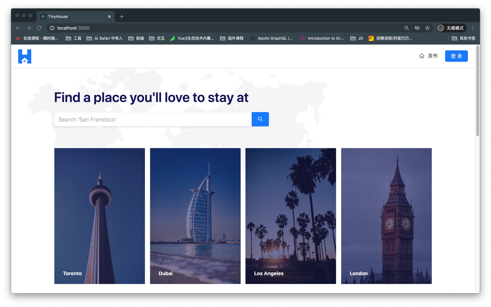

当用户尝试使用Google登录进行登录时，系统会提示他们提供其Google帐户信息，并在成功后会被允许进入登录状态的TinyHouse应用程序。


### 搜索功能

用户几乎可以搜索在任何地方发布的 House ，用户可以使用主页或菜单中的搜索功能。

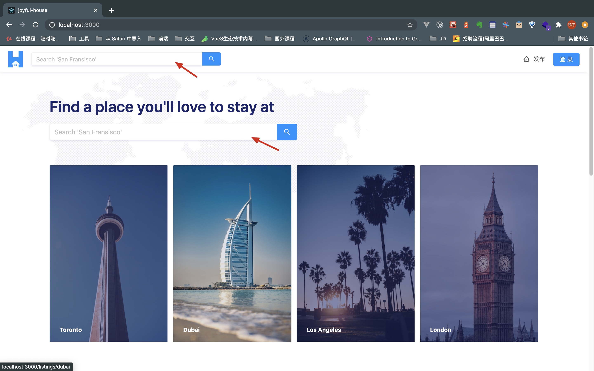

进行搜索后，用户将被重定向到具体的页面，在此页面中他们可以查看指定位置创建的所有House。

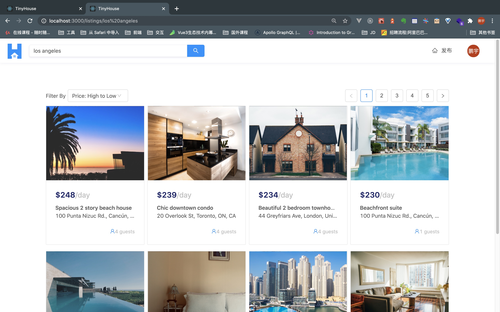

### House 详情

当用户从提供给他们的列表的 House 中选择一个后，关于 House 的特定详细信息将显示给用户，包括但不限于 House 的描述标题、图像、地址和房东...

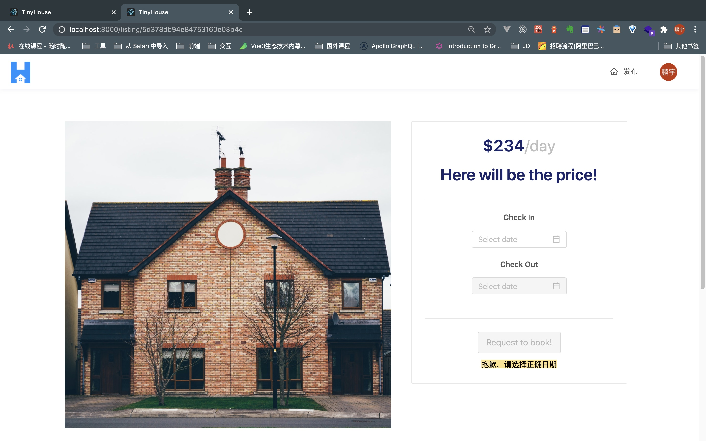

### 订阅

在 House 详情中，用户可以在特定时间段内预订House。

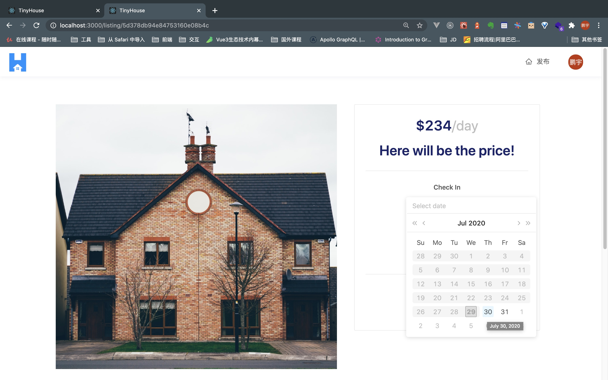

选择合法的有效日期后，系统会通过提供有效的付款信息(即有效的信用卡/借记卡)提示用户确认预订。

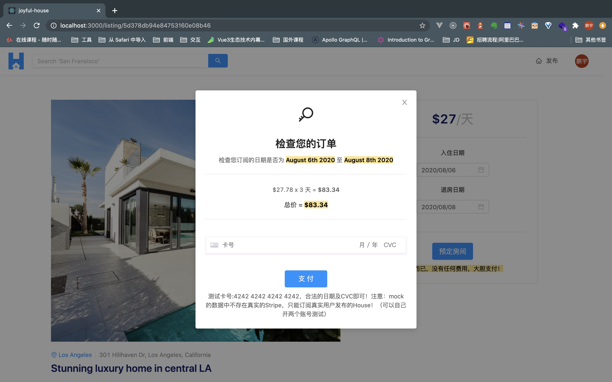

### 连接 Stripe

如果用户有兴趣在 app 中托管和/或创建 House，他们首先需要连接其 Stripe帐户(测试直接跳过)，这将使他们能够从其他用户处接收付款。用户将在用户页面的“用户个人资料”中连接其Stripe帐户。

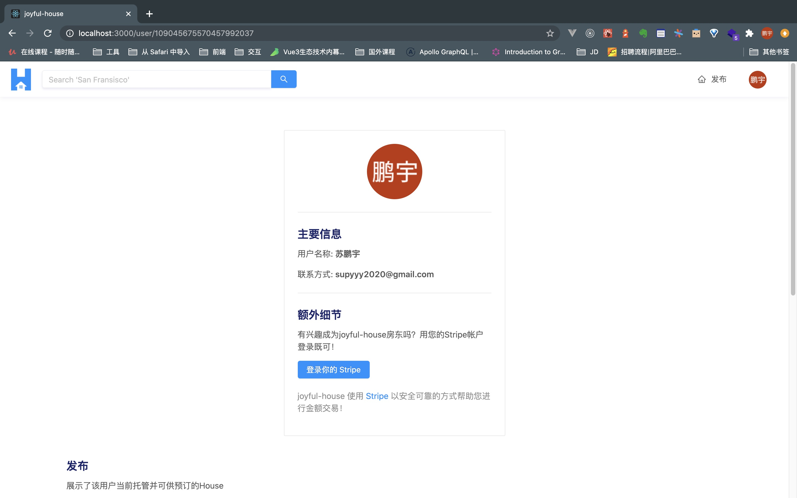

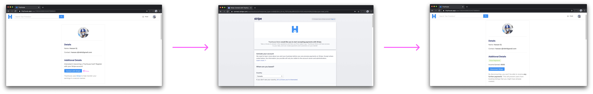

当用户尝试连接其Stripe帐户时，系统将提示他们提供其Stripe帐户信息，并在成功后将重定向到TinyHouse应用程序。

### 创建 House

登录并与Stripe连接后，用户可以够创建新 House。在该页面中，用户需要为新列表提供所有有效信息，例如但不限于列表标题、图像、地址和价格...


### 查看历史订单

登录并位于自己帐户的用户页面中，用户将可以查看他们创建的所有 House 的历史记录外加其他预订的 House 信息。

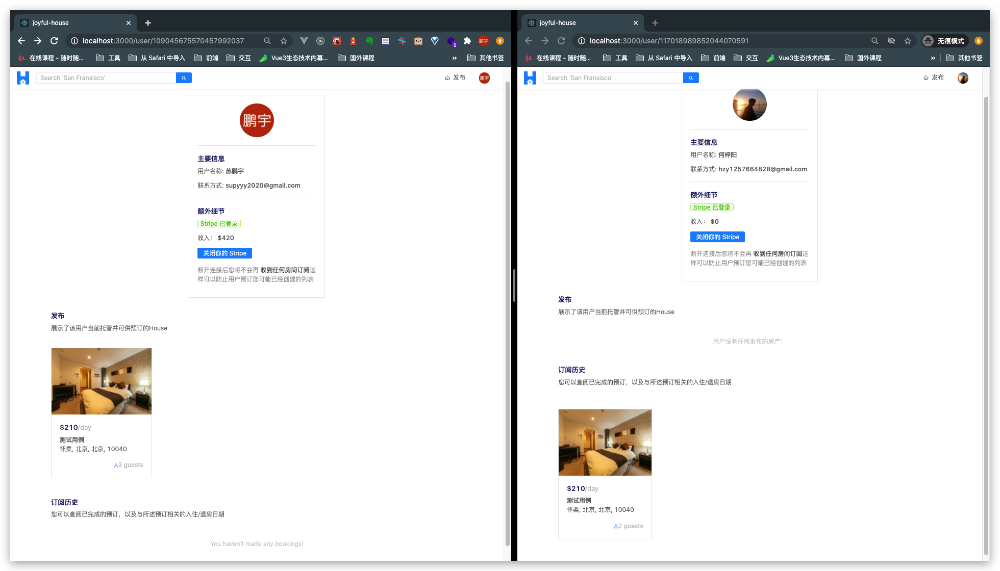

当用户查看自己拥有的 House 详细信息时，还可以查看其他用户对特定列表的预订。

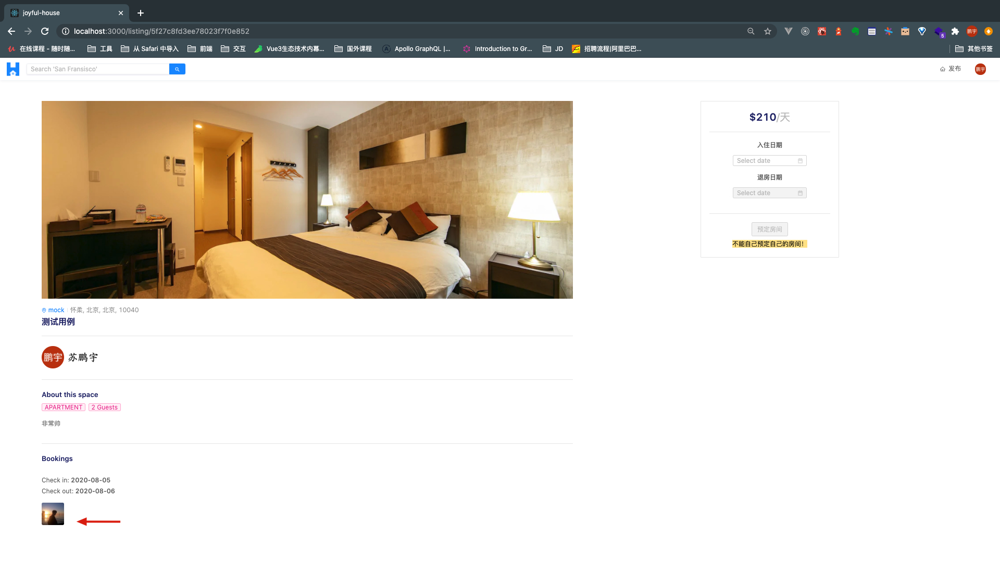

### 查看其他用户

在app中访问其他用户页面时，可以查看他创建的所有 House 信息。

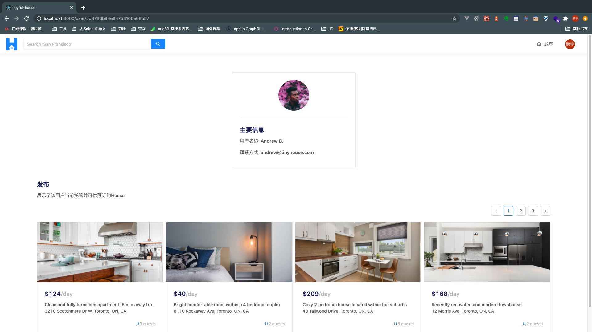


## Walkthrough of Code

### API-Driven Approach

- 通过API驱动的方法来构建app，这意味着我们将要开发一个暴露服务器数据和业务逻辑的接口（即GraphQL API）。

- 我们的client将与此API进行交互，例如查询或提交数据。

- 此API驱动的开发模型有助于分离后端和前端代码。例如，我们要构建多个前端客户端以与同一API进行交互，则可以在此API基础上增加额外的功能从而实现前后端项目解耦。

### server

该服务端项目采用 `Node / Express` 作为http服务器，其职责是提供`GraphQL API`并与我们的`MongoDB`数据库进行交互，例如查询或持久化数据。

```shell
server/
  src/
  temp/
  .env
  .eslintrc.json
  package.json
  README.md
  tsconfig.json
```

#### src


```shell
server/
  src/
    database/
    graphql/
    lib/
    index.ts
  // ...
```

`src/database/`文件夹用于连接到`MongoDB Atlas`，在这里编写关于 `MongoDB`数据库的一些代码逻辑。

在我们的MongoDB数据库中，将有三个集合：

- "user"集合，用于在我们的应用程序中存储用户的信息。
- "listings"集合，用于在我们的应用程序中存储房屋信息。
- "bookings"集合，用于存储在我们的应用程序中进行的预订的信息。

`src/graphql/`文件夹是创建 `GraphQL API`的地方。在这里将定义实际API 的 `typeDefs` 以及负责解析API字段的`resolver`（等同于RESTful 中的 controller）。

`src/lib/`文件夹将保留在服务器项目中不同地方共享的代码：

- 定义与第三方API（例如Cloudinary、Stripe和Google API）进行交互；
- 将存储将在服务器项目的不同部分中使用的所有公共方法；
- 一些TypeScript类型定义；

#### temp

在服务器项目的`temp/`目录中建立`seed()`函数，以使用模拟的数据填充到MongoDB数据库中，这些数据将在构建应用程序时起到辅助开发的作用。 

我们还将有一个`clear()`函数，以便在需要时用于清除数据库。

`server/`中的其他所有内容都涉及项目的环境设置,该环境设置包括但不限于:
- 定义环境配置变量
- ESLint配置
- TypeScript配置
- 应用程序所依赖的依赖项

### client

**客户端项目将是一个React / TypeScript项目**，我们将在其中构建一个SPA应用。

```shell
client/
  public/
  src/
  .env
  .gitignore
  package.json
  README.md
  schema.json
  tsconfig.json
```


#### `src/`

```shell
client/
  // ...
  src/
    lib/
    sections/
    styles/
    index.tsx
    react-app-env.d.ts
    serviceWorker.ts
  // ...
```

根`src/index.tsx`文件是实例化`Apollo client` 和 `GraphQL API`交互的地方，也是我们开发根组件`<App/>`的地方，它将代表React应用。

在`<App />`组件中，我们将使用[React Router](https://reacttraining.com/react-router/web/guides/quick-start)(第三方库)创建client路由，并根据router呈现不同的组件。这些路由组件将在`src/ sections/`文件夹中定义。

在`src/lib/`文件夹中，保存了项目中使用的base组件、公共函数、GraphQL documents 以及TypeScript类型定义。

在`src/styles/`目录中，并将包含一个index.css文件，包含需要的所有自定义CSS类和样式。同时与[Ant Design UI](https://ant.design/)框架结合使用，以用于构建TinyHouse应用程序的UI元素。

在src /文件夹之外，还包含了：

- `public/`目录，带有标记`index.html`文件，该文件带有要在其中挂载我们的React的root elements。
- `package.json`文件，其中包含我们的应用程序依赖项。
- 一个自动生成的`schema.json`文件，代表我们的GraphQL API，并使用[Apollo CLI](https://github.com/apollographql/apollo-tooling#apollo-cli)工具生成。
- `.env`文件，其中介绍了打算保留在React项目中的环境变量。


## Code Patterns


## TODO


